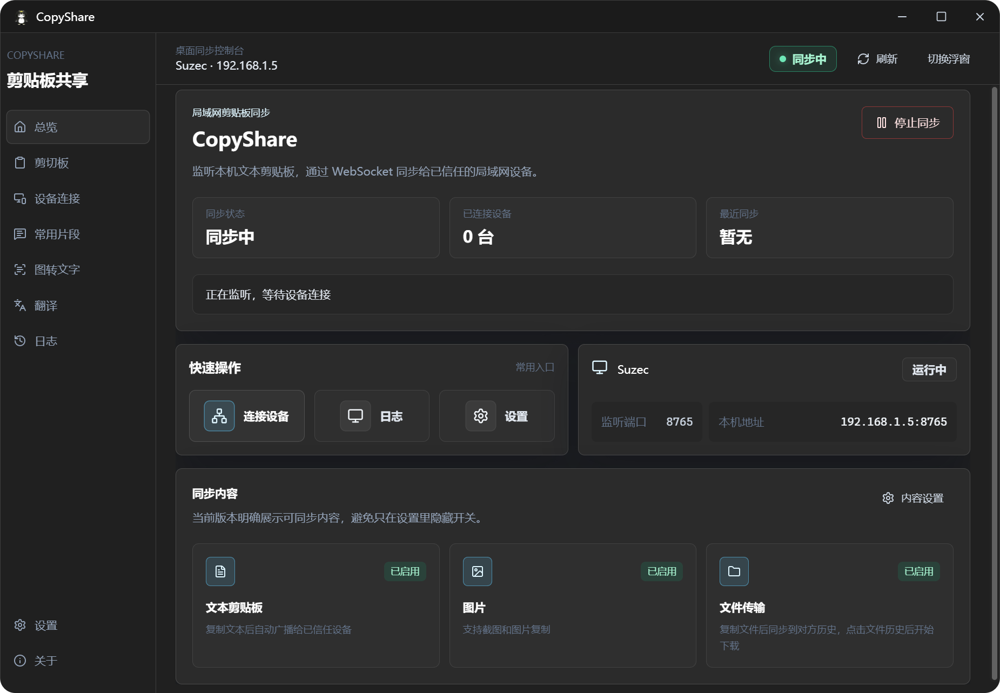
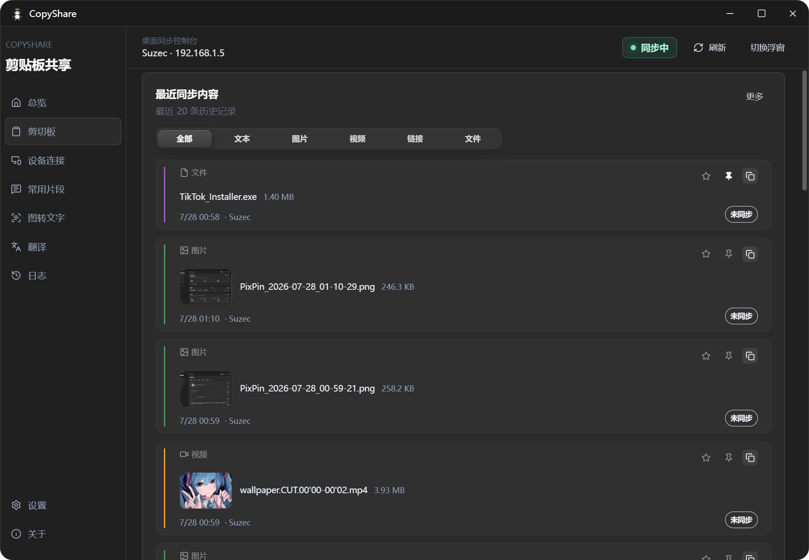
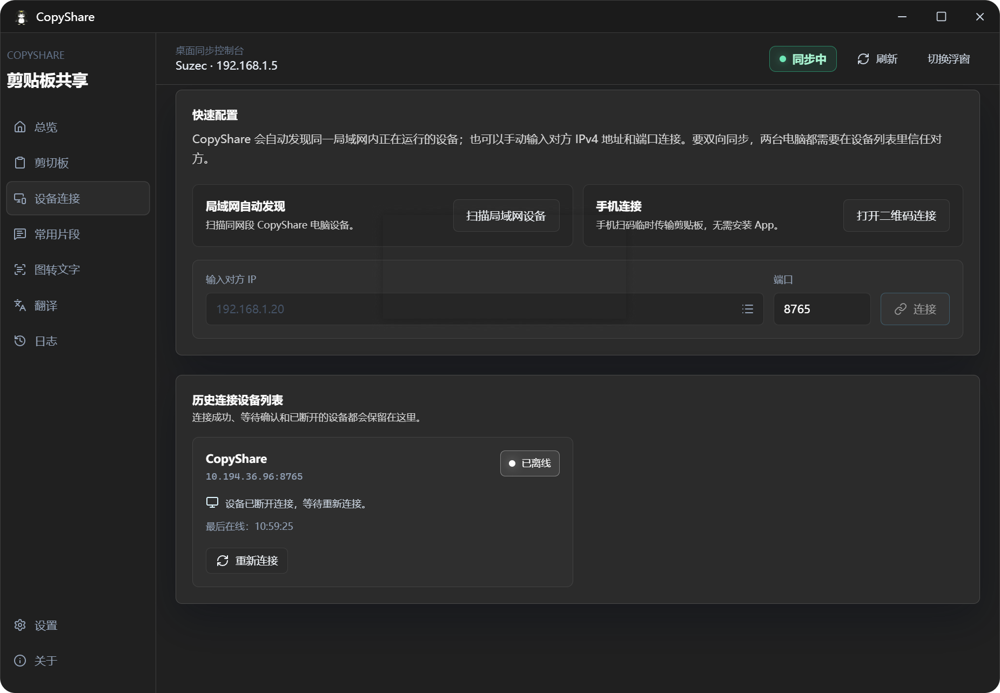
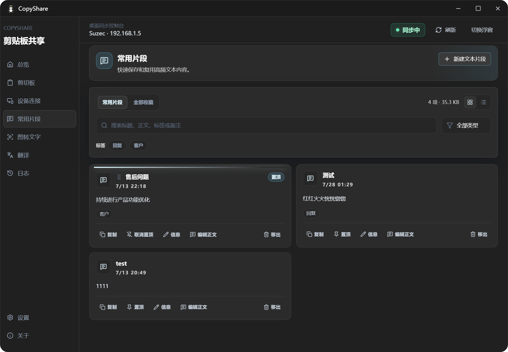

<div align="center">


# CopyShare

**LAN clipboard sync, file transfer, and content productivity for multiple devices**

Sync text, screenshots, images, and files between trusted computers. Download large files on demand with resumable transfers, and keep clipboard history, snippets, local OCR, translation, temporary mobile access, and a desktop floating panel close at hand.

[](https://github.com/suzeccc/CopyShare/releases/latest)
[](https://github.com/suzeccc/CopyShare/actions/workflows/release.yml)

[](LICENSE)

<p><a href="./README.md">简体中文</a> · <strong>English</strong></p>

[Download the latest release](https://github.com/suzeccc/CopyShare/releases/latest) · [Quick start](#quick-start) · [Privacy and security boundaries](#privacy-and-security-boundaries)

</div>

## Why CopyShare

CopyShare is designed for trusted LANs in offices, dorms, and homes. It does not depend on a CopyShare cloud service: after two devices trust each other, they can exchange clipboard content and files directly.

| Capability | Experience |
| --- | --- |
| Reliable multi-device sync | Automatically discovers trusted devices and forms a sync mesh; deterministic ordering, deduplication, and bounded delivery queues reduce reordering, loops, and slow-peer buildup |
| On-demand large-file downloads | The receiver sees a file entry first and downloads it when needed; tasks support pause, retry, and resume after an application restart |
| Content organization | Search and filter clipboard history, keep important items in the library, or turn them into editable, pinnable, sortable snippets |
| Local productivity tools | Local image OCR, Google or custom AI translation, QR-based mobile access, and image/video previews |
| Fast desktop access | Floating panel, five configurable global shortcuts, tray controls, desktop notifications, autostart, and automatic sync |
| Diagnosable LAN connectivity | Checks listeners, discovery, network profile, and firewall state; Windows can create private-network inbound rules for the current executable |

## Quick start

1. Install and open CopyShare on two or more computers that can reach each other on the same LAN.
2. Open **Devices** and wait for automatic discovery. If discovery fails, enter the other device's IPv4 address and listening port manually.
3. Approve the trust request on both sides. Previously trusted devices reconnect automatically and join the sync mesh when they return.
4. Copy text, a screenshot, an image, or files. Text and images sync according to your settings; files appear in the receiving application and are saved only after download.

> [!TIP]
> If a device cannot be found, open **Settings → Network diagnostics** first. It checks sync, discovery and mobile ports, the Windows network profile, and firewall rules, then provides specific guidance.

## Downloads and platforms

Open [GitHub Releases](https://github.com/suzeccc/CopyShare/releases/latest) and choose the package for your system:

| Platform | Intended devices |
| --- | --- |
| Windows x64 | Most Intel or AMD Windows computers |
| Windows ARM64 | ARM Windows computers such as Snapdragon X Elite and X Plus devices |
| macOS Apple Silicon | Macs with M1, M2, M3, M4, or later Apple silicon |
| macOS Intel | Intel-based Macs |
| Linux | Choose the package format provided for your distribution |

> [!NOTE]
> OCR uses the Windows system OCR engine on Windows, Apple Vision on macOS, and the bundled Simplified Chinese and English Tesseract fast models in official Linux packages. Each package contains only the OCR backend required by that platform.

## Interface preview

<table>
  <tr>
    <td width="50%" align="center"><strong>Sync dashboard</strong><br></td>
    <td width="50%" align="center"><strong>Clipboard history</strong><br></td>
  </tr>
  <tr>
    <td width="50%" align="center"><strong>Device connections</strong><br></td>
    <td width="50%" align="center"><strong>Library and snippets</strong><br></td>
  </tr>
</table>

<p align="center">
  <strong>Desktop floating panel / quick panel</strong><br>
  
</p>

## Core features

### Clipboard sync and multi-device reliability

- Sync text, screenshots, images, and file clipboard content; videos are handled as files.
- Enable or disable text, image, and file sync independently, and choose whether to filter duplicate content.
- Trusted devices reconnect automatically and form a multi-device sync mesh without manual pair-by-pair maintenance.
- Concurrent updates converge through a stable version order, and already applied messages are not forwarded again in a loop.
- Each peer uses a bounded control queue and coalesces pending clipboard updates to the latest value, preventing unbounded buildup behind a slow device.
- History records time, source device, and sync status. New history can be disabled, and existing history can be cleared.

### File transfer and resumable downloads

- After one or more files are copied, the receiver gets metadata and a download entry first. CopyShare does not automatically load an entire large file into memory or write it directly to the receiver's clipboard.
- Downloads stream over HTTP Range. Interrupted tasks preserve completed bytes and can retry automatically, pause, or continue manually.
- A valid transfer can resume after either the sender or receiver restarts. If the source changes, verification fails, or authorization expires, the task stops instead of combining incompatible data.
- Download tokens are bound to the receiving device, byte offset, and expiration, and are consumed once for their intended operation.
- Individual files have no separate cap; sending and receiving share the task-level limit.
- The hard limit is **10 GiB total per task**, so a single-file task can contain a file up to 10 GiB.
- Change, open, or reset the download directory, and choose whether to open the folder after a transfer completes.

> [!NOTE]
> A file transfer consumes upload traffic on the sender and download traffic on the receiver. Actual speed depends on both network adapters, Wi-Fi or Ethernet, storage performance, and LAN congestion.

### Clipboard history, library, and media previews

- Filter by all content, text, images, videos, links, or files, and search by keyword.
- Expand long text, open links with the system browser, and zoom image previews.
- Local videos have thumbnails and a separate preview window. If the operating system cannot decode a format, open the file location instead.
- Favorite or pin history items. Library items are not removed when ordinary history is cleared.
- Add titles, tags, and notes to saved items, search them, or convert text items into reusable snippets.
- Create, edit, copy, pin, and drag-sort snippets.
- Switch the library between grid and list layouts and inspect its local storage usage.

### Global shortcuts and desktop integration

Shortcuts can be enabled, changed, or reset independently. If a shortcut conflicts or registration fails, CopyShare preserves the previous working configuration.

| Action | Default shortcut | Default state |
| --- | --- | --- |
| Show/hide quick panel | `Alt+Shift+V` | Enabled |
| OCR clipboard image | `Alt+Shift+O` | Disabled |
| Translate clipboard text | `Alt+Shift+T` | Disabled |
| Open snippets | `Alt+Shift+B` | Disabled |
| Pause/resume sync | `Alt+Shift+S` | Disabled |

- The quick panel supports arrow-key selection, `Enter` to copy, and `Esc` to close.
- Tray actions open the main window, start or stop synchronization, or exit the application.
- Closing the main window can ask every time, minimize to the tray, or exit directly. The native close button and `Alt+F4` use the same policy.
- Desktop notifications, single-instance behavior, system autostart, and automatic sync on launch are available.

### Network diagnostics and Windows Firewall

- Check the sync TCP port, UDP discovery port, and temporary mobile-connection port.
- See listener state, the LAN address, Windows network profile, and private-network firewall state.
- Inspect firewall coverage for synchronization, discovery, and mobile access, with actionable recommendations for each result.
- On Windows, **Repair firewall** creates private-network inbound rules only for the current CopyShare executable. It never changes a public network to private automatically.
- VPNs, virtual adapters, guest Wi-Fi, and router client isolation can still prevent discovery or connectivity.

### OCR, translation, and temporary mobile access

- Paste a screenshot, bitmap, or image file into **Image to text**. Preprocessing and OCR run locally; the result can be edited, copied, or cleared.
- Google translation does not require an API key. AI translation accepts your own endpoint, API key, model, and proxy.
- A computer can generate a temporary QR code. A phone browser can scan it to view offered text or submit text back to the computer.
- Mobile sessions can be closed manually; their QR code and session become invalid immediately.
- The interface supports Simplified Chinese and English, and saves the selected language locally.

### Settings, notifications, and cache

- Configure device name, listener port, theme, synchronized content, file-size limits, download directory, and close behavior.
- Choose from Win11 Dark, Midnight Glass, Graphite Mist, and Tea Green themes.
- Control notifications for clipboard updates, trust requests, file transfers, device status, and sync failures, and send a real test notification.
- Configuration writes are serialized. If a save is blocked or fails, the interface rolls back to the last successfully stored configuration instead of showing an unsaved value.
- Cache management reports local storage used by image history, thumbnails, video thumbnails, and related assets, and can clear that cache.
- Check for updates at startup or manually from the **About** page, then open the release page.

## Privacy and security boundaries

- Clipboard content is not uploaded to a CopyShare-operated cloud service. Synchronization, library data, and OCR data are processed only on the local computer and connected LAN devices.
- Device trust controls who may participate in synchronization, but it is not an end-to-end encrypted transport intended for the public internet or an untrusted shared network. Use CopyShare only on trusted LANs and trust only explicitly authorized devices.
- A temporary mobile session becomes invalid after it is closed. Do not share its QR code with untrusted people.
- When Google or custom AI translation is used, the text being translated is sent to the selected translation service. Do not send sensitive content to an external translation provider.
- Your AI API key is stored in your own local configuration. Use a dedicated key and manage it carefully.
- Update checks access the GitHub Releases API. Other LAN synchronization features do not depend on a CopyShare cloud service.
- A clipboard may contain passwords, verification codes, or private files. Pause synchronization or disable the relevant content type before handling sensitive data.

## FAQ

### Why can't CopyShare find another device?

1. Confirm that CopyShare is running on both computers and that they can reach each other on the same LAN.
2. Open **Settings → Network diagnostics** and follow the listener, network-profile, and firewall results.
3. Temporarily rule out VPNs, virtual adapters, guest Wi-Fi, and client isolation.
4. Enter the other device's IPv4 address and listening port manually in **Devices**.

### Why is a file not placed directly on the receiving clipboard?

This is intentional. The receiving application shows a file entry first and saves the file only after the user downloads it. This prevents an unconfirmed large file from automatically consuming disk, network, and memory resources. An incomplete task can continue when transfer conditions recover.

### What are the large-file limits?

Individual files have no separate cap. A task cannot exceed **10 GiB** in total, so a one-file task can contain a file up to 10 GiB while multi-file tasks are limited by their combined size.

### Why is content not updating after the devices connect?

- Confirm that both sides completed the trust flow instead of remaining in a pending state.
- Check that synchronization is running and that the relevant text, image, or file switch is enabled.
- If the same content was copied recently, check whether duplicate-content filtering is enabled.
- Read the specific error in logs or desktop notifications, then run network diagnostics.

### Why can't a video be previewed?

Desktop media support does not cover every video codec. CopyShare keeps the file entry and reports a preview error; open the file location and use another player when necessary.

### Where are received files saved?

The default location is a `CopyShare` folder inside the system Downloads directory. Use **Settings → Download location** to change, open, or reset it.

## Development and builds

### Requirements

- Node.js and npm
- Rust stable toolchain
- [Tauri 2 system prerequisites](https://v2.tauri.app/start/prerequisites/)

### Common commands

```powershell
npm install
npm run tauri:dev
npm run build
npm run build:exe
npm run tauri:build
node --test tests/*.test.ts
cd src-tauri
cargo test
```

| Command | Purpose |
| --- | --- |
| `npm run tauri:dev` | Start the desktop application in development mode |
| `npm run build` | Type-check and build the frontend |
| `npm run build:exe` | Build the current platform executable without an installer |
| `npm run tauri:build` | Build the current platform installer packages |
| `node --test tests/*.test.ts` | Run Node behavior and structure tests |
| `cargo test` | Run Rust backend tests |

## Technology and releases

- [Tauri 2](https://tauri.app/) + Rust: desktop runtime, LAN communication, file transfer, and system integration
- [Vue 3](https://vuejs.org/) + TypeScript + Pinia: interface, routing, and frontend state
- [Tailwind CSS](https://tailwindcss.com/): interface styling

A `v*` tag or manual run of the [Release workflow](.github/workflows/release.yml) builds Windows x64/ARM64 NSIS, macOS Apple Silicon/Intel, and Linux packages, then creates a draft GitHub Release. Use [GitHub Releases](https://github.com/suzeccc/CopyShare/releases/latest) as the source of truth for published versions.

## License

CopyShare is available under the [MIT License](LICENSE).
